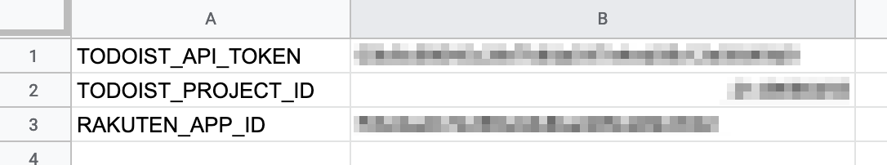
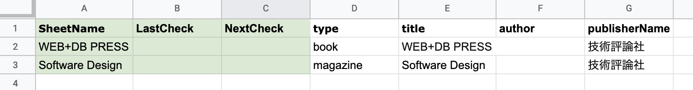

# Newbooks2Todoist

[](https://github.com/google/clasp)


A GAS(Google Apps Scripts) application for finding new book release and add your todo list of Todoist.

## Getting start

### Create Rakuten App ID and Todoist API token

- Rakuten App ID
  - Access [Rakuten Web Service: Application list](https://webservice.rakuten.co.jp/app/list) to create your Rakuten App Id
- Todoist API token
  - Access [Integrations](https://todoist.com/prefs/integrations) to create your Todoist API token

### Deploy GAS scripts

```bash
$ git clone https://github.com/HeRoMo/newbooks2todoist.git
$ cd newbooks2todoist
$ yarn install
$ yarn clasp:login
$ yarn clasp:create
$ yarn clasp:push
```

### Configuration

Open container spreadsheet and create two sheets named *CONFIG* and *INDEX*.

#### CONFIG

Create *CONFIG* sheet looks like the followind image.



Define application the following configurations in *CONFIG* sheet.

|Name| Value|
|---|---|
|TODOIST_API_TOKEN|Todoist API Token|
|TODOIST_PROJECT_ID| Todoist project ID. |
|RAKUTEN_APP_ID|Rakuten App ID|

This app add items to Todoist Project indicated by TODOIST_PROJECT_ID.

#### INDEX

Create *INDEX* sheet looks like the followind image.



Define the following columns.

| Culomn|Description|
|---|---|
|SheetName|**Required** |
|	LastCheck	|DO NOT FILL yourself. this column is written by this app.|
|NextCheck|DO NOT FILL yourself. this column is written by this app.|
|	type|**Required**`book` or `magazine`|
|	title	|Book title which you want to search.|
|author|Book author which you want to search|
|publisherName|Publisher name which you want to search.|

## Run GAS Script

Open GAS script editor by using `yarn clasp:open`.
Then, open *Code.gs* and run `execute` function.

**Recomended**
Run `execute` function on a recurring interval with time-driven trigger.

## LISENCE
[MIT](./LICENSE)


